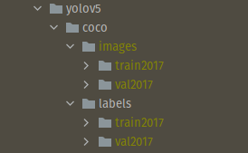

- [ ] Section 0: 
  
   درباره ایده اصلی استفاده شده در شبکه های RCNN, Fast RCNNو Faster RCNN  توضیح دهید.

   `[ توضیحات خود را در این جا وارد کنید]`
  
- [ ] Section 1: داده

   در ما قصد داریم شبکه [yolov5](https://github.com/ultralytics/yolov5)  برای تشخیص عینک دودی و عینک معمولی بر روی صورت آموزش دهیم.
برای این کار ابتدا داده های لازم را از این [لینک](https://drive.google.com/drive/folders/1v_oO8qkNSEBlE28d81eZ0UimPQuuZoxt?usp=sharing) دانلود کنید.
حال با استفاده این [سایت](https://www.makesense.ai/)  عینک دودی و عینک معمولی را در دو کلاس جداگانه روی دیتا لیبل بزنید. نیاز نیست دسته عینک را لیبل بزنید و فقط چهارچوب اصلی عینک در لیبل باشد. سپس لیبل ها را دانلود کنید. 
حال داده ها را به دو بخش تست و آموزش تقسیم کنید. در نهایت نحوی قرار گیری دیتا به شکل زیر می شود. (در صورتی که نتواستید دیتا را به درستی آماده کنید می توانید به بخش train custom data در گیت yolov5 مراجعه کنید.)

   
- [ ] Section 2: آموزش مدل

حال مدل را با ساختارهای yolov5n و yolov5s روی داده ها آموزش دهید. درباره ی معیار IOU و الگوریتم Non Max suppression توضیح دهید.
  
   `[ نتایج و توضیحات  و ساختار شبکه تان را اینجا بنویسید]`

- [ ] Section 3: yolov7 [extra]

مدل [YOLOv7](https://github.com/jinfagang/yolov7) را با داده های قسمت قبلی آموزش دهید.

   `[ نتایج و توضیحات  و ساختار شبکه تان را اینجا بنویسید]`