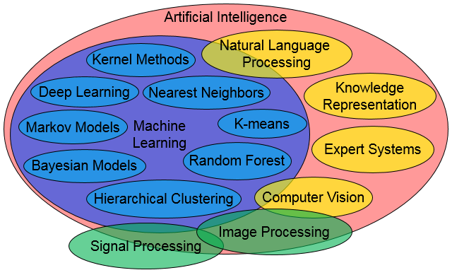
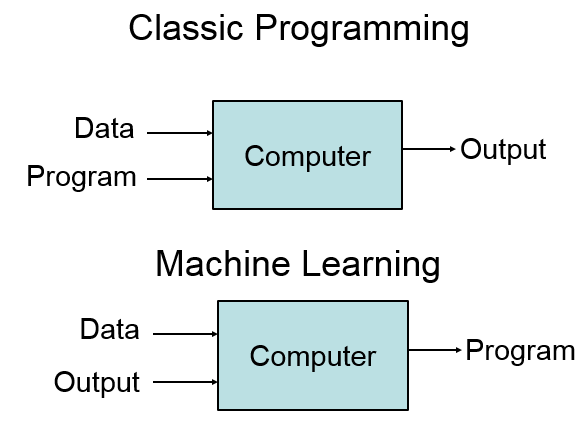

در این بخش به مرور مباحث یادگیری ماشین می‌پردازیم. پیش‌فرض ما در این جا این است که شما با این مباحث آشنایی دارید و این مباحث صرفا جنبه مرور و یادآوری دارد.

به طور کلی اگر بخواهیم یک دسته‌بندی از هوش مصنوعی ارائه دهیم می‌توانیم به شکل زیر اشاره کنیم:

به طور کلی یادگیری ماشین یک زیرمجموعه از هوش مصنوعی است که با سایر حوزه‌های هوش مصنوعی ارتباط تنگاتنگی دارد. اگر بخواهیم یک هدف کلی برای یادگیری ماشین مشخص کنیم می‌توانیم بگوییم که کار یادگیری ماشین تخمین تابع است. در واقع در حوزه یادگیری ماشین تلاش داریم تا روابط بین پدیده‌ها را با یک تابع مدل کنیم. این تابع می‌تواند با دریافت یک یا چند ورودی، یک یا چند خروجی را برای ما تولید کند.

اگر بخواهیم یک نگاه کلی به یادگیری ماشین بیندازیم و آن را با برنامه‌نویسی عادی مقایسه کنیم، می‌توانیم بگوییم که در برنامه‌نویسی، برنامه و داده ورودی به ماشین داده می‌شود و ماشین با اجرای برنامه بر روی داده ورودی، داده خروجی را تولید می‌کند. اما در یادگیری ماشین، نتوانیم برای تولید داده خروجی از ورودی برنامه‌ای بنویسیم. لذا هم داده ورودی و هم داده خروجی به ماشین داده می‌شود و از این جا به بعد، وظیفه‌ی به دست آوردن برنامه مناسب برای تولید خروجی از ورودی به عهده ماشین خواهد بود. به شکل زیر توجه کنید.

اما برای این که ماشین بتواند رابطه بین ورودی و خروجی را تشخیص دهد باید روش‌ها و الگوریتم‌هایی را به ماشین بدهیم که بتواند رابطه بین ورودی و خروجی را تشخیص دهد. برخی از مهم‌ترین این روش‌ها در زیر لیست شده‌اند:

- Linear Regression

- Logistic Regression

- K-Nearset Neighbors (KNN)

- Support Vector Machine (SVM)

- Naive Bayes

- Decision Tree

- Random Forest

- Single Perceptron

- Neural Networks

- K-means

- Principal Component Analysis (PCA)

  