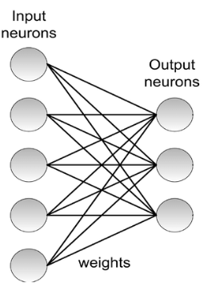
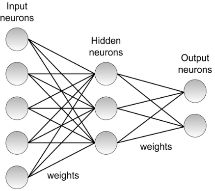

در این بخش قصد داریم تا به معرفی شبکه‌های عصبی و یادگیری عمیق بپردازیم. دلیل این که شبکه‌های عصبی و پردازش عمیق در یک بخش مورد بحث و بررسی قرار می‌گیرند این است که عنصر محوری در یادگیری عمیق شبکه‌های عصبی هستند. به جرات می‌توان گفت که اغلب روش‌های یادگیری عمیق نوعی شبکه‌ی عصبی هستند که می‌توانند با دادگانی از انواع گوناگون کار کنند. در این بخش ابتدا شبکه‌های عصبی را تعریف می‌کنیم و سپس چندین شبکه‌ی عصبی عمیق را مورد مطالعه قرار می‌دهیم.

## کتابخانه‌ی مورد استفاده

پیش از پرداختن به مفاهیم شبکه‌های عصبی و به طور کلی یادگیری عمیق، باید توجه کنید که در این دوره آموزشی، برای مباحث شبکه‌های عصبی و یادگیری عمیق از کتابخانه pytorch استفاده خواهیم کرد. این کتابخانه شامل ابزارهای متنوعی است که به ما اجازه می‌دهد تا بتوانیم هر نوع شبکه‌ی عصبی‌ای که مد نظرمان است را طراحی کنیم. شما نیز موظف هستید تا تمرین‌های مرتبط با شبکه‌های عصبی را با استفاده از این ابزار طراحی نمایید.

برای آشنایی با این کتابخانه می‌توانید از [این ویدئو](https://www.youtube.com/watch?v=GIsg-ZUy0MY) استفاده کنید.

## شبکه‌های عصبی

همان طور که از نام شبکه‌های عصبی می‌توان دریافت، این ابزار از سیستم عصبی انسان الهام گرفته شده است. اما ما در این جا تفسیر عصبی از این شبکه‌ها را نمی‌آوریم. بلکه صرفا تفسیری کاربردی را ارائه می‌کنیم که مبتنی بر جبرخطی است. در نگاه کلی یک شبکه عصبی یک تخمین‌زننده تابع است که می‌تواند ارتباط بین هر دو پدیده که به هم مرتبط هستند را کشف کند. شبکه‌های عصبی می‌توانند در انواع مسائل مورد استفاده قرار گیرند. به عنوان نمونه مسائل دسته‌بندی، رگرسیون و سایر مسائل این حوزه. با وجود این که شبکه‌های عصبی عمدتا برای صورت مسئله‌های باناظر مورد استفاده قرار می‌گیرند، اما در صورت مسئله‌های بدون‌ناظری چون خوشه‌بندی و کاهش ابعداد داده نیز مورد استفاده قرار می‌گیرند.

ورودی یک شبکه عصبی می‌تواند عدد اسکالر، بردار، ماتریس یا تنسور با ابعاد بالا باشد. خروجی آن نیز می‌تواند عدد اسکالر، بردار، ماتریس یا تنسور با ابعاد بالا باشد. از همین مطلب می‌توان دریافت که شبکه‌های عصبی صرفا با داده عددی کار می‌کنند و برای مسائلی که ورودی و خروجی آن‌ها غیر عددی است باید ایده‌هایی مورد استفاده قرار گیرد که داده غیرعددی را به داده عددی تبدیل کند. 

اگر ورودی و خروجی یک شبکه عصبی عدد اسکالر باشد، می‌توان تابع معادل با آن شبکه را به صورت $f:\mathbb{R} \rightarrow \mathbb{R}$ نشان داد. 

اگر ورودی شبکه یک بردار و خروجی آن یک عدد اسکالر باشد، می‌توان تابع معادل با آن را با $f:\mathbb{R}^n \rightarrow \mathbb{R}$ نشان داد.

اگر ورودی شبکه عصبی یک  بردار و خروجی آن نیز یک بردار باشد می‌توانیم تابع معادل با آن را به صورت $f:\mathbb{R}^n \rightarrow \mathbb{R}^m$ نشان دهیم.

اگر ورودی شبکه عصبی یک  ماتریس و خروجی آن نیز یک عدد اسکالر باشد می‌توانیم تابع معادل با آن را به صورت $f:\mathbb{R}^{n \times m} \rightarrow \mathbb{R}$ نشان دهیم.

به طور کلی اگر ورودی شبکه یک تنسور از بعد $r$ و خروجی یک تنسور از بعد $q$ باشد، می‌توان تابع معادل با شبکه را به صورت زیر نمایش داد:

$$f:\mathbb{R}^{n_1 \times n_2 \times ... \times n_r} \rightarrow \mathbb{R}^{m_1 \times m_2 \times ... \times m_q}$$

برای ابتدای کار از ساده‌ترین نوع شبکه عصبی شروع می‌کنیم. شبکه عصبی تک پرسپترون شبکه‌ای است که یک بردار را در ورودی می‌گیرد و یک عدد اسکالر خروجی می‌دهد. به عنوان مثال فرض کنید می‌خواهیم قیمت یک خانه را بررسی ویژگی‌های آن پیش‌بینی کنیم. در این جا کلیه‌ی ویژگی‌های مربوط به یک خانه را در یک بردار قرار می‌دهیم و آن را به عنوان ورودی در نظر می‌گیریم. قیمت خانه را نیز به عنوان خروجی در نظر می‌گیریم. اکنون کافی هست تا هر ویژگی از خانه را که در بردار ورودی قرار دارد در یک ضریب، ضرب کنیم  و سپس با هم جمع کنیم تا یک عدد حاصل شود.  فرض کنید که بردار ویژگی‌های ورودی $x = (1, x_1, ..., x_m)$ بردار وزن‌ها $w = (w_0, w_1, ..., w_m)$ باشد. در این صورت خروجی برابر ضرب داخلی این دوبردار یعنی $w.x$ خواهد بود. خروجی‌ای که تا این جا به دست آمد یک خروجی خطی است. ممکن است خروجی مسئله به گونه‌ای باشد که نتوان آن را با یک مدل خطی تخمین زد بر سر راه خروجی‌ای که تا این جا به دست آمد یک تابع، تحت عنوان تابع فعالساز اعمال می‌شود تا مدل غیرخطی شود. در مثال زیر تابع فعالساز یک تابع پله است. توجه کنید که در بردار $x$ اولین عنصر برابر 1 است. این عدد متناسب با ضریب $w_0$ است. به این ضریب بایاس می‌گویند.

اکنون که معماری مدل معرفی شد، باید در جستجوی روشی باشیم که ضرایب $w$ که به آن وزن‌ها یا پارامترهای مدل نیز گفته می‌شود پیدا شوند. برای انجام این کار از الگوریتم گرادیان کاهشی یا gradient descent استفاده می‌کنیم. این الگوریتم بدین صورت عمل می‌کند که ابتدا تمامی وزن‌های مدل را در لحظه صفر مقداردهی اولیه می‌کند و سپس با رابطه‌ی زیر وزن‌ها را در چندین مرتبه یا لحظه به روز می‌کند.

$$w^{(t)} = w^{(t-1)} - \alpha\frac{\partial L}{\partial w^{(t-1)}} = w^{(t-1)} - \alpha\nabla_{w^{(t-1)}} L$$

که در رابطه فوق $t$  از عدد 1 شروع می‌شود و تا جایی ادامه پیدا می‌کند که تفاضل $w^{(t-1)}$ و $w^{(t)}$ برابر صفر یا از یک حد آستانه کمتر شود. همچنین $w^{(0)}$ را نیز از پیش مقداردهی اولیه کرده‌ایم. $L$ در اینجا تابع خطا است که فاصله‌ی مقدار پیش‌بینی شده مدل از خروجی واقعی را به ما می‌دهد (توجه کنید که صرف نظر از نوع و بُعد خروجی شبکه، L باید در نهایت باید یک عدد اسکالر باشد). 

همچنین به $\alpha$ نرخ یادیگری گفته می‌شود که معمولا عددی کوچک انتخاب می‌شود. 

از آن‌جایی که به این الگوریتم گرادیان کاهشی می‌گویند، باید در این رابطه از گرادیان (مشتق اسکالر نسبت به بردار، ماتریس یا تنسور) استفاده شده باشد. این مشتق را در رابطه فوق مشخص کرده و تفسیر کنید. 

برای آشنایی بیشتر با الگوریتم کاهشی می‌توانید به [این ویدئو](https://www.youtube.com/watch?v=yFPLyDwVifc) مراجعه کنید.

> تمرین1:  ابتدا مجموعه دادگان قیمت خانه را از [این لینک](https://archive.ics.uci.edu/ml/machine-learning-databases/housing/) دانلود کنید. اکنون با استفاده از کتابخانه‌ی pytorch یک مدل پرسپترون طراحی کنید که قیمت خانه را بر اساس ویژگی‌های آن پیش‌بینی کند. توجه کنید که شما باید مجموعه دادگان را به سه قسمت آموزش (train)، ارزیابی (validatio) و آزمون (test) تقسیم کنید. از قسمت آموزش و ارزیابی برای یافتن بهترین مدل و از قسمت آزمون برای ارزیابی نهایی مدل استفاده کنید.

مدلی که در بالا بررسی کردیم در واقع دارای یک خروجی  اسکالر (نورون) بود. حال اگر خروجی یک بردار باشد یا به عبارت دیگر تعداد خروجی‌ها چند عدد اسکالر (چند نورون) باشد، می‌توان ورودی را در چندین بردار ضریب (وزن)، ضرب نمود و چندین خروجی تولید کرد.  یک مثال را در شکل زیر مشاهده می‌کنید که یک مدل پرسپترونی با چند نورون در لایه خروجی است.

در شبکه‌ای که در بالا مشاهده می‌کنید ورودی یک بردار است و این بردار در یک ماتریس (که به آن ماتریس وزن گفته می‌شود) ضرب می‌شود و یک بردار را به ما خروجی می‌دهد. این مدل ساده به ما انگیزه می‌دهد تا به جای این که در یک مرحله از ورودی به خروجی برویم، ابتدا از ورودی به یک لایه میانی برویم و سپس از آن لایه به لایه خروجی برویم. به این لایه میانی، لایه مخفی (hidden layer) گویند. همچنین از آن‌جایی که ما در چندین لایه پرسپترون عادی را تکرار کردیم به این شبکه پرسپترون چندلایه یا Multi-Layer Perceptron (MLP) می‌گویند. یک شبکه MLP را در زیر مشاهده می‌کنید.  

اگر به لایه‌های مدل MLP توجه کنیم متوجه می‌شویم که در هر لایه، تمامی نورون‌های ورودی آن لایه به تمامی نورون‌های خروجی متصل شده است. به همین خاطر به این لایه‌ها، لایه‌های تماما متصل یا fully connected می‌گویند.

برای آموزش این شبکه نیز باید گرادیان نسبت به وزن‌های هر لایه محاسبه شود. برای این کار باید در جهت خروجی به ورودی قاعده زنجیری مشتق‌ها را اعمال کنیم که به این فرایند پس‌انتشار یا backpropagation می‌گویند.

## مقدمه‌ای بر شبکه‌های عصبی عمیق و یادگیری عمیق

همان طور که دیدیم، می‌توان با افزودن یک لایه مخفی، شبکه را پیچیده‌تر نمود. واضح است که اگر این فرایند ادامه پیدا کرده و تعداد لایه‌ها افزایش یابد شبکه عمیق و عمیق‌تر می‌شود. در واقع با افزایش تعداد لایه‌ها به شبکه‌ای می‌رسیم که این شبکه یک شبکه عمیق است. محور یادگیری عمیق شبکه‌های عصبی عمیق است.

گاهی اوقات خود یک شبکه ذاتا عمیق نیست بلکه در صورتی که آن را بر روی یک داده اعمال می‌کنیم، عمیق می‌شود. همانند شبکه‌های عصبی بازگشتی یا Recurrent Neural Network (NN).  پس در واقع عمیق بودن بدین معنی است که چند لایه از شبکه زیر هم چیده شده است یا این که اعمال وزن‌های شبکه به داده ورودی به صورت مکرر انجام می‌شود. 

> تمرین2:  با استفاده از یک شبکه عصبی MLP چهار لایه یک مدل دسته‌بند بر روی مجموعه دادگان اعداد دست‌نویس MNIST طراحی کنید. مدل خود را با معیار دقت، Precision، Recall و F1 ارزیابی کنید (برای آشنایی با معیارهای گفته شده، می‌توانید به [این لینک](http://cs230.stanford.edu/fall2018/PrecisionRecallF1.pdf) مراجعه کنید). 
>
> ** توجه کنید که برای طراحی و آموزش مدل از کتابخانه pytorch استفاده کنید. 