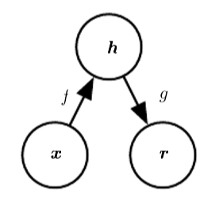
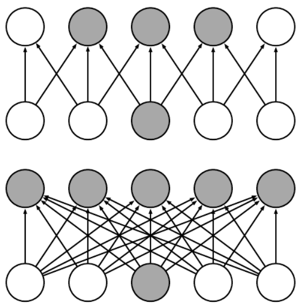

# شبکه‌های عصبی عمیق

در این چند سالی که از عمر هوش مصنوعی می‌گذرد، تحقیقات در این رشته سبب شده است که بسیاری از مسائل که تا سالیان درازی برای انسان قابل حل نبود، به سادگی توسط ماشین قابل حل شود. یکی از تاثیرگذارترین زیرشاخه‌ها از هوش مصنوعی که این موضوع را سبب می‌شود، زیرشاخه‌ی یادگیری ماشین می‌باشد که با توسعه‌ی شبکه‌های عصبی توانست ارتباط بین پدیده‌های طبیعی را که گاها دارای پیچیدگی زیادی بودند، کشف کند. اما عدم کشف ویژگی مناسب و هزینه محاسباتی بسیار زیاد در داده‌های با ابعاد بالا سبب شد تا نتوان از روش‌های یادگیری ماشین و به ویژه محبوب‌ترین این تکنیک‌ها نظیر شبکه‌های عصبی و ماشین بردار پشتیبان استفاده کرد. یک راه حل ساده برای رهایی از این مشکل طراحی روش‌هایی بود که بتوانند همزمان با یادگیریِ روابط بین داده‌ها، عملیات استخراج ویژگی را نیز انجام دهند و این سرآغازی بر شبکه‌های عصبی عمیق بود. در ادامه چندین شبکه‌ی عصبی عمیق را مورد بررسی قرار می‌دهیم.

## شبکه‌های عصبی خودکدگذار (Autoencoder)

شبکه‌ی عصبی خودکدگذار شبکه‌ای است که ورودی‌اش را در خروجی‌اش بازسازی می‌کند . در این نوع از شبکه عصبی ابتدا باید ورودی را به داده‌ی کد شده تبدیل نمود و سپس داده‌ی کد شده را مجددا به شکل اولیه ورودی تبدیل کرد. در شکل زیر لایه‌ی $h$ نشان‌دهنده‌ی یک لایه‌ی مخفی است که حاصل آن داده‌ی کد شده می‌باشد. این شبکه عصبی ممکن است به صورت دو بخشی در نظر گرفته شود: یک تابع کدگذار  $h=f(x)$ و یک تابع کدشکن $r=g(h)$. معماری این شبکه را درشکل زیر مشاهده می‌کنید.

 

ایده‌ شبکه‌های عصبی خودکدگذار مربوط به سالیان اخیر نیست بلکه پیشینه‌ای طولانی در عمر شبکه‌های عصبی دارد. به صورت سنتی شبکه‌های عصبی خودکدگذار برای کاهش بعد و یادگیری ویژگی، بسیار استفاده می‌شوند اما ارتباط بین متغیر مخفی و شبکه‌های عصبی خود رمزگذار باعث به وجود آمدن شبکه‌های عصبی خودکدگذارِ تغییراتی با کارایی بسیار بالا شده است که این موضوع سبب شده است شبکه‌های عصبی خودرمزگذار در صدر روش‌های مولد قرار گیرد.

یکی از راه‌کارهایی که سبب می‌شود شبکه‌های عصبی خودکدگذار ویژگی‌های مناسبی را پیدا کند این است که لایه‌ی *$h$ * را محدود کنیم که تعداد واحدهای (نورون‌های) آن از تعداد واحدهای ورودی کمتر باشد. این نوع از شبکه‌های عصبی خودکدگذار را که اندازه لایه مخفی از لایه ورودی کمتر است شبکه‌های عصبی خودکدگذار ناکامل می‌گویند. 

فرایند آموزش این شبکه‌ها با کمینه کردن تابع خطای زیر انجام می‌شود. 

$$\ell(x, g(f(x)))$$

که در آن $\ell$ تابع خطایی است که $g(f(x))$ را در صورت عدم شباهت به خروجی هدف جریمه می‌کند.

> تمرین1:  با استفاده از سه لایه شبکه عصبی تماما متصل، یک شبکه عصبی خودکدگذار طراحی کنید که تصاویر دست‌نویس مجموعه داده MNIST را در خروجی بازسازی کند. (از کتابخانه pytorch برای این کار استفاده کنید). توجه شود که برای انجام این پروژه یک روز کفایت می‌کند.

## شبکه‌های عصبی پیچشی یا کانولوشنی (CNN)

شبکه‌ی عصبی کانولوشنی (CNN)  نوعی شبکه‌ی عصبی است که بر روی داده‌هایی که دارای توپولوژی مشبکه است عملکرد بسیار خوبی را از خود نشان می‌دهد. برای مثال داده‌های سری زمانی که می‌توان آن را به صورت مشبکه‌ی یک بعدی در طول بازه‌های زمانی مشخص در نظر گرفت یا داده‌های تصویر که می‌توان آن را به صورت مشبکه‌ی دو بعدی در نظر گرفت. شبکه‌های عصبی CNN عملکرد فوق‌العاده‌ای را از خود در کارهای عملی به جا گذاشته است. 

### عملگر کانولوشن

عبارت "کانولوشن" در نام این نوع از شبکه‌ی عصبی این موضوع را مشخص می‌کند که عملیات ریاضی کانولوشن در این شبکه‌ی عصبی اعمال شده است. عملیات کانولوشن به صورت کلی بر روی تنسور با هر بعدی قابل انجام است. اما برای سادگی فرض می‌کنیم داده‌ی ورودی تنها به متغیر $t$ وابسته باشد (عملیات کانولوشن یک بعدی). در این صورت عملیات کانولوشن مطابق رابطه ‏زیر تعریف می‌شود. نماد $*$ نشان‌دهنده‌ی عملگر کانولوشن است.

$$s(t) = (x*y)(t)$$

$$s(t)=\sum_{a=-\infty}^{\infty} x(x).w(t-a)$$

در واژه‌شناسی شبکه عصبی کانولوشنی در رابطه فوق، اولین آرگون یعنی $x$ را داده‌ی ورودی، دومین آرگومان یعنی $w$ را هسته (کرنل یا فیلتر) و $s(t)$ را نگاشت ویژگی (فیچر مپ) می‌نامند. در رابطه فوق کرانی برای $t$ در نظر گرفته نشده است اما در صورت که $t$ محدود باشد کران متانظر با آن به رابطه اعمال می‌شود.

#### سه ایده‌ی اصلی در CNNها

شبکه‌های عصبی کانولوشنی از سه ایده‌ی بسیار مهم و اساسی استفاده می‌کنند که این سه ایده عبارتند از: 1) اتصال اسپارس2) اشتراک پارامترها 3) ثابت بودن نسبت به انتقال

لایه‌های شبکه‌های عصبی MLP از ضرب ماتریس به همراه یک ماتریس وزنی استفاده می‌کنند که هر یک از عناصر ماتریس به صورت جداگانه نشان‌دهنده‌ی ارتباط یک واحد (نورون) ورودی و یک واحد (نورون) خروجی است. این موضوع سبب می‌شود که تعداد پارامترها به شکل قابل ملاحضه‌ای زیاد شود. اما شبکه‌های عصبی CNN از اتصال اسپارس یا پراکنده بهره می‌برد. به عنوان نمونه فرض کنید یک تصویر هزاران یا چند میلیون پیکسل داشته باشد اما فقط قسمتی از تصویر مانند لبه‌هایی که با استفاده از کرنل‌ها به دست آمده است و دارای ده‌ها یا صدها پیکسل است با معنی باشد. این بدین معنی است که نیاز به ذخیره‌سازی تعداد بسیار زیادی از پارامتر نیست و برای بخش‌های با معنی، باید تعداد کمی پارامتر آموزش داده و ذخیره شود. این موضوع سبب کاهش استفاده حافظ توسط مدل به دست آمده می‌شود و نتایج آماری خوبی را به دست می‌دهد. به صورت سنتی اگر $m$ واحد ورودی و خروجی $n$ واحد خروجی برای یک لایه در دسترس باشد آنگاه ماتریس وزن از مرتبه‌ی $O(m \times n)$ است. حال اگر پارامترهای ورودی به هر واحد خروجی را به $k$ محدود کنیم در آن صورت $O(k \times n)$ پارامتر نیاز داریم. باید توجه داشت که غالبا $m$ و $n$ دارای مرتبه یکسان هستند و لذا برای $k$ بسیار کوچکتر از این می‌باشد. در واقع این موضوع سبب می‌شود وزن‌های شبکه اسپارس شود. به شکل زیر توجه کنید.

اکنون با آشنا شدن با مقدمات شبکه‌های عصبی CNN در یک بعد، می‌توانیم این شبکه‌ها را برای دو بعد یا بیشتر تعمیم دهیم. در حالت دوبعدی این شبکه‌ها بر روی تصاویر قابل اعمال هستند. برای آشنایی با این شبکه‌ها در حالت دو بعدی، لایه pooling و انواع معماری‌های شبکه‌های عصبی CNN به [این سری ویدئو](https://www.youtube.com/playlist?list=PLkDaE6sCZn6Gl29AoE31iwdVwSG-KnDzF) از andrew ng مراجعه کنید.

> تمرین2: از مدل کانولوشنی Resnet50 استفاده کرده و یک مدل دسته‌بند برای مجموعه دادگان Cifar10 آموزش دهید. توجه کنید که شما باید دادگان را به سه بخش آموزش (train)، ارزیابی (validation)  آزمون (test) تقسیم کنید. همچنین مدل خود را با معیارهای دقت، Precision، Recall، F1 و ماتریس آشفتگی (Confusion Matrix) ارزیابی کنید.

## شبکه‌ی عصبی بازگشتی (RNN)

شبکه‌ی عصبی بازگشتی یا RNN  یک خانواده از شبکه‌های عصبی می‌باشد که برای پردازش داده‌ی دنباله‌ای نظیر $x = {{x_t}}_{t=1}^{T}$  طراحی شده است. برخلاف شبکه‌های عصبی MLP، شبکه‌های عصبی RNN صرفا رو به جلو نبوده و دارای دور می‌باشد و با بهره‌گیری از این ویژگی می‌توانند براساس یک تاریخچه‌‌ از خروجی‌های پیشین، خروجی متناسب با ورودی حال حاضر را تولید کنند. مسائلی را که به صورت یک سری زمانی یا به شکل یک دنباله بیان می‌شوند معمولا می‌توان با استفاده از RNNها مورد بررسی قرار داد. به عنوان نمونه برای پیش‌بینی وضعیت آب‌وهوا باید متناسب با وضعیت جوی چند روز گذشته تصمیم‌گیری شود. یا برای پیش‌بینی قیمت ارز باید براساس تغییرات قیمتی آن در بازه‌های گذشته این پیش‌بینی انجام شود.

