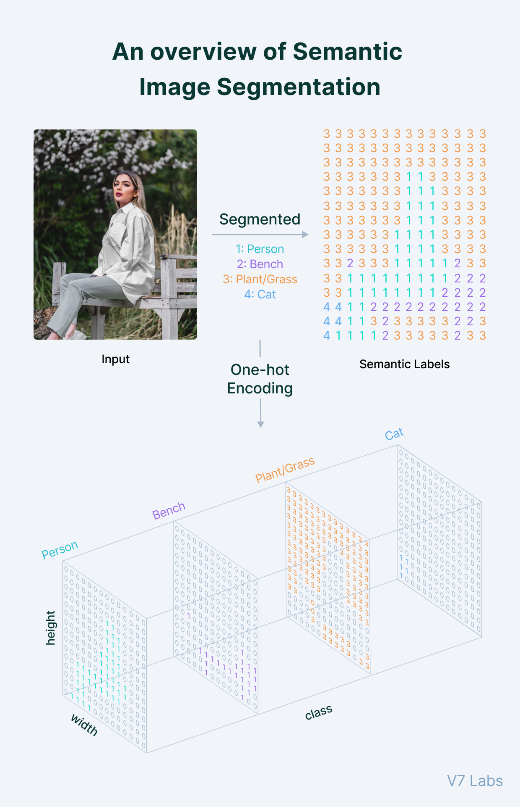

# Segmentation

### مقدمه
بخش بندی تصاویر یکی از تسک های شناخته شده  و مهم است که در خیلی جاها کاربرد صنعتی دارد. در ادامه این سوال که میخواهیم object های موجود در تصاویر را به دست بیاوریم، این سوال پیش می آِید که چگونه دقیقا محل  اشیای دلخواه خود را 
در سطح پیکسل تعیین کنیم؟
جواب این سوال همان چیزی است که Segmentation به دنبال آن است. 

در این موضوع میخواهیم هر شیء را از شیء دیگر در سطح پیکسل جداسازی کنیم و هر شیء را با یک رنگ تعیین کنیم.
این کار باعث میشود در خیلی از موارد تحلیل های ما بعد از این راحتتر بشود چون به جای اینکه یک تخمین کلی از مستطیل در برگیرنده شیء داشته باشیم، محل دقیق هر شیء را بر اساس مفهوم
جداسازی کنیم.

کاربردهایی بسیار از این موضوع میتوان پیدا کرد: مثلا تشخیص سلولهای سرطانی،  یا در ماشین های خودران و ...

### انواع مختلف segmentation

۱. Semantic segmentation

در این نوع قصد داریم که هر پیکسلی از تصویر را به یک label نسبت دهیم. در این مورد اینگونه عمل میکنیم که همه ماشینهای موجود در تصویر را به یک برچسب ماشین متناسب میکنیم. 
همینطور برای همه اشیای موجود در تصویر این کار را میکنیم و به اشیای **مشابه** لیبل **یکسان** بدهیم. 

۲. Instance segmentation

حالا اگر بخواهیم کمی پیشرفته تر بشویم، میتوانیم هر کدام از اشیای موجود در تصویر را به طور مجزا لیبل بزنیم. یعنی  اگر چند ماشین در یک تصویر داشته باشیم، باید 
هر کدام از ماشین ها را در تصویر با رنگ های مختلف نشان دهیم و لیبلهای با شماره های مختلف بزنیم.

در این مورد هم، همه اشیای موجود در تصویر لیبل میخورند.

۳. Panoptic segmentation

حوزه جدیدی است که هدف آن ترکیب دو مورد قبلی است. 
یعنی در ضمن اینکه چند شیء از یک جنس را به طور مجزا به عنوان اشیای جداگانه تشخیص میدهیم‌(instance segmentation) ، همه اشیای موجود در یک تصویر را  که از یک جنس هستند را تشخیص بدهیم (semantic segmentation) یعنی مثلا
چند ماشین را به طور مجزا نشان دهیم و در ضمن  تشخیص دهیم که همگی از جنس ماشین هستند.

### روشهای مختلف segmentation

روشهای متنوعی از سالهای قبل وجود داشته که الزاما با هوش مصنوعی این کار را نمیکردند، بلکه با ترکیب عملیاتهای پردازشی تصویر این کار را میکردند. 
نظیر الگوریتم های adaptive thresholding , Region based methods, Edge based methods ,...
این کار را میکردند اما ما در اینجا میخواهیم سابقه این کار را در deep learning بررسی کنیم. 

در deep learning قصدمان این است که هر پیکسلی را به یک کلاس نسبت بدهیم. در واقع ورودی ما یک عکس nکاناله است و خروجی ما یک عکس تک کاناله است که هر پیکسل آن لیبل کلاس متناظرش را خورده است. 
حالا شبکه هایی وجود دارند که این کار را میکنند. دقیقا همانطور که در classification یک کلاس را تعیین میکنیم، در اینجا باید برای هر پیکسلی این کار را بکنیم.

شبکه های segmentation عمدتا از یک ساختار encoder-decoder استفاده میکنند. این ساختارها به این مفهوم هستند که تصویر ورودی را به یک فضای با ابعاد پایین تر میبریم تا ویژگی ها را به صورت فشرده تر و قابل تشخیص تر به نسبت با بقیه پیکسل ها داشته باشیم. سپس از  آن فضا  به فضای با ابعاد اصلی مساله برمیگردیم و عملیات segmentation را انجام میدهیم.

#### Convolutional Encoder-Decoder

- ۱. ساختار های encoder-decoder based از زمان مقاله SegNet در سال ۲۰۱۵ معروف شد. 
میتوانید با جست و جو، این مقاله را مطالعه کنید ولی به طور خلاصه کار آن را توضیح میدهیم. 

این ساختار ترکیبی از لایه های کانولوشنی و downsampling  را استفاده میکند و ترکیب میکند تا به یک bottleneck برسد و در یک فضای با ابعاد پایین تر، ویژگی ها را به دست می آورد و سپس قسمت decoder از ویژگیهای به دست آمده، segment map را بازسازی میکند.

در نهایت یک لایه sigmoid در انتها قرار داده می شود. 

- ۲. همزمان، ساختار دیگری با همین ایده و با اندکی تاخیر به اسم U-Net  در مقاله ها پیدا شد و نتایج خوبی به دست آورده بود. ضمنا شبکه سبکی نیز بود.

این ساختار هم encoder-decoder based  ایده جدیدتری که می باشد ولی با این تفاوت که از ایده جدیدتر skip connection نیز استفاده کرده است.
توضیح skip-connection را از منتورها بخواهید ولی به طور خلاصه ایده ای هست که برای رفع مشکل gradient vanishingاستفاده میشود. 

- ۳. بعد از U-Net، فیسبوک مدل جدیدتر و قوی تری را به اسم Deep lab معرفی کرد. این مدل ایده های جدیدی را پیاده کرده که میتوانید آنرا در نت مشاهده کنید. بعد از این مرحله هم، تعداد زیادی مقاله های مختلف با ایده های مختلف و ترکیبی از ایده های قبلی،  شبکه های قوی تری را معرفی کردند.
  

> تمرین ۱:    یکی از دیتاست های [Oxford-IIIT pet](https://www.robots.ox.ac.uk/~vgg/data/pets/) یا MBRSC satellites را دانلود کنید

>>    بااستفاده از مدل U-Net  بر روی یکی از دیتاست های بالا آموزش را با هر config دلخواهی انجام دهید. دقت کنید مجاز نیستید از کتابخانه های آماده  ای که مدل u-net را به طور مستقیم و بدون جزییات وارد میکنند، استفاده کنید.برای شروع و یادگیری بیشتر میتوانید به این [لینک](https://pyimagesearch.com/2021/11/08/u-net-training-image-segmentation-models-in-pytorch) مراجعه کنید

> تمرین  ۲ (اضافی) : اگر فرصت کردید، از مدل Deeplab استفاده کنید و آن را آموزش بدهید و در جایگاه پایین ایده های اصلی مقاله آن را توضیح دهید.

