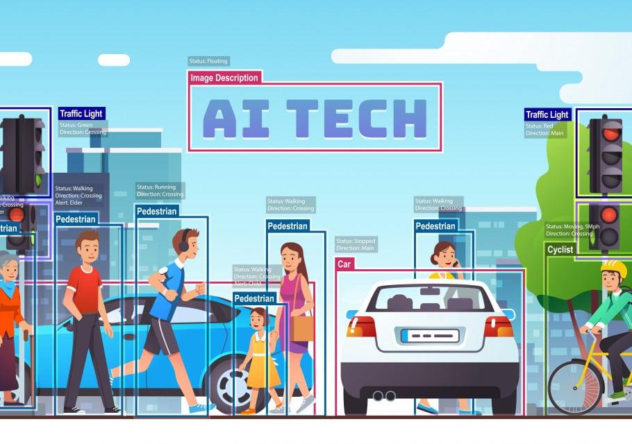
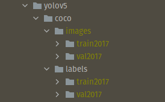

# Object detection 

### مقدمه

در object detection ما به دنبال پیدا کردن اشیا یا هر شئ با معنی در تصویر هستیم.(مثل انسان ها، حیوانات و …) هدف شبکه پیدا کردن boxهایی است که شامل اشیا مورد نظر و میزان اطمینان ما به تشخیص مورد نظر می باشد.

در این بخش با دو دسته از شبکه های پر کاربرد در تسک object detection آشنا می شوید.
شبکه های R-CNN ای و YOLO.

### R-CNN
شبکه R-CNN یا Regions with CNN Features، یک شبکه object detection است که از ساختارهای CNNای برای استخراج ویژگی از بخش های مختلف یک تصویر استفاده میکند. برای آشنایی بیشتر این [لینک](https://www.analyticsvidhya.com/blog/2018/10/a-step-by-step-introduction-to-the-basic-object-detection-algorithms-part-1/) را مطالعه کنید.

### YOLO
ِشبکه YOLO یکی از سریع ترین و دقیق ترین شبکه هایی است که در تسک object detection به کار می رود و تا کنون ورژن های مختلف آن در دسترس کاربران قرار گرفته است، مثل YOLO3, YOLO5 و YOLOX. در این [لینک](https://www.analyticsvidhya.com/blog/2018/12/practical-guide-object-detection-yolo-framewor-python/?utm_source=blog&utm_medium=a-step-by-step-introduction-to-the-basic-object-detection-algorithms-part-1) با ساختار شبکه YOLO بیشتر آشنا می شوید.

>تمرین ۱ :    درباره ایده اصلی استفاده شده در شبکه های RCNN, Fast RCNNو Faster RCNN  توضیح دهید.

>> دیتا:
   در ما قصد داریم شبکه [yolov5](https://github.com/ultralytics/yolov5)  برای تشخیص عینک دودی و عینک معمولی بر روی صورت آموزش دهیم.برای این کار ابتدا داده های لازم را از این [لینک](https://drive.google.com/drive/folders/1v_oO8qkNSEBlE28d81eZ0UimPQuuZoxt?usp=sharing) دانلود کنید.
حال با استفاده این [سایت](https://www.makesense.ai/)  عینک دودی و عینک معمولی را در دو کلاس جداگانه روی دیتا لیبل بزنید. نیاز نیست دسته عینک را لیبل بزنید و فقط چهارچوب اصلی عینک در لیبل باشد. سپس لیبل ها را دانلود کنید. 
حال داده ها را به دو بخش تست و آموزش تقسیم کنید. در نهایت نحوی قرار گیری دیتا به شکل زیر می شود. (در صورتی که نتواستید دیتا را به درستی آماده کنید می توانید به بخش train custom data در گیت yolov5 مراجعه کنید.)

>> 

>> حال مدل را با ساختارهای yolov5n و yolov5s روی داده ها آموزش دهید. درباره ی معیار IOU و الگوریتم Non Max suppression توضیح دهید.

> تمرین  ۲ (اضافی) :مدل [YOLOv7](https://github.com/jinfagang/yolov7) را با داده های قسمت قبلی آموزش دهید.

  

