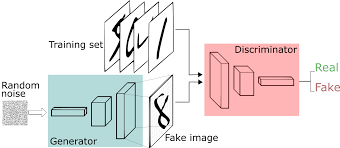

# Generative Adversarial Network

### مقدمه
شبکه های GAN شبکه های جدیدتری هستند که هم نحوه آموزش آنها هم ساختار و طرز کار آنها متفاوت است. از این نوع ساختارها زیرمجموعه ای از شبکه های generative یا مولد هستند. دقت کنید شبکه هایی که تا الان با آنها آشنا شده اید، اکثرا از جنس discriminative یا تشخیصی می باشند و فقط برای این استفاده می شوند که ورودی را بگیرند و یک عملیات تشخیصی روی آنها انجام دهند. اما نوع دیگری از شبکه ها نیز موجودند که به دنبال این هستند که توزیع خاصی از جنس شبیه به دیتاهای ورودی یا تبدیل یافته آنها را بتوانند تولید کنند. 

شاید اسم Deepfake به گوشتان خورده باشد.  این نوع خاصی از شبکه های GAN می باشد. 

برای آشنایی با طرز  کار شبکه های GAN از این [لینک](https://towardsdatascience.com/generative-adversarial-networks-explained-34472718707a) شروع کنید

و این [لینک](https://machinelearningmastery.com/what-are-generative-adversarial-networks-gans/) را نیز مطالعه کنید. 

این [لینک](https://wiki.pathmind.com/generative-adversarial-network-gan) هم برای مشاهده همزمان کدی مثالی از شبکه GAN و توضیح مفهوم آن، مناسب است.

برای یادگیری عمیق تر مفهوم آن از ویدیوی زیر استفاده کنید.

[1](https://www.youtube.com/watch?v=8L11aMN5KY8)

نمونه ای از ساختار کلی شبکه Convolutional GAN را میبینید.

> تمرین ۱ :    تسک این فاز بیشتر پژوهشی است و در نهایت توضیح ساختاری است که در ادامه می آید. یکی از کارهایی که با شبکه های GAN انجام میدهند، تبدیل یک فضای تصویری به یک فضای تصویری دیگر است.  یعن به طور مثال تبدیل عکس یک اسب در یک محیط به یک عکس گورخر در همان محیط یا محیط دیگر. 
>  یکی از اولین ها و پیشرو ترین ها در این حوزه، مقاله [pix2pix](https://phillipi.github.io/pix2pix/) است.ابتدا یا اصل این مقاله را بخوانید، یا از صفحه پیوست شده یا از اینترنت، ایده های اصلی را استخراج کنیم. (لازم نیست خیلی جزٔیی بخوانید، صرفا کافی است بتوانید ساختار کلی را توضیح داده و ایده های اصلی ای که برای آموزش مدل از آن استفاده کرده است را توضیح دهید.) است. 

>حالا از صفحه [github](https://github.com/phillipi/pix2pix) آن، کد را clone کنید و سعی کنید از کد با تصاویر مختلف ولی با توزیع نزدیک به دیتاستی که با آن، مدل آموزش دیده، تست بگیرید.

>  (اضافی)تمرین  ۲ : 
   بعد از انتشار این مقاله، اشخاص مختلفی برای تبدیل دو فضا به یکدیگر از این ساختار استفاده کردند. که نمونه آنها را در صفحه pix2pix که در بالا پیوست شده بود، میتوانید مشاهده کنید. یکی از دیتاست ها را به دلخواه انتخاب کرده و آموزش را روی آن انجام دهید و نتایج را گزارش کنید. اگر دیتاست دیگر یا ایده دیگری نیز برای تبدیل دو فضا به یکدیگر دارید، آن را به کار ببرید و آموزش دهید

