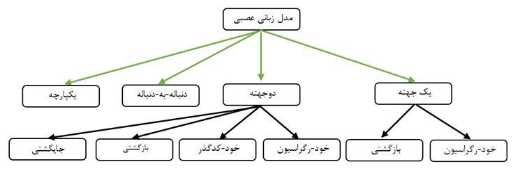

## مدل‌های زبانی عمیق

در بخش قبل با شبکه‌های ترنسفورمری آشنا شدید. همچنین پیشتر با شبکه‌های بازگشتی آشنا شدید و مسائلی نظیر دسته‌بندی متون و دسته‌بندی توکن را حل کردید. اگر مدل‌های زبانی آماری را با این شبکه‌های عصبی ادغام کنیم آن‌گاه مدل‌های زبانی عمیق حاصل می‌شود. مدل‌های زبانی عمیق برخلاف مدل‌های زبانی آماری،نیاز به محدود کردن متن زمینه برای پیش‌بینی ندارد و می‌تواند از تمامی متن ورودی برای پیش‌بینی یک توکن جدید استفاده کند. این مدل‌ها معمولا به صورت خود-نظارتی (self-supervised) آموزش می‌بیند. نشان داده شده است که این مدل‌های زبانی بهترین عملکرد را در تسک پیش‌بینی کلمات داشته‌اند. همچنین در این مدل‌ها این قابلیت وجود دارد که بتوان سایر تسک‌های NLP را نیز پیشرفت داد و دقت و عملکرد آن‌ها را بسیار ارتقا داد. 

برای آن که بتوان در سایر تسک‌های NLP از مدل‌های زبانی عمیق استفاده کر، باید مدل از پیش‌اموزش داده شده‌ (pretrained) زبانی را بر روی مدل تسک مد نظرمان تنظیم دقیق (fine-tune) کنیم. از بین تمامی مدل‌های زبانی عمیق، مدل‌های زبانی مبتنی بر شبکه‌های عصبی ترنسفورمر توانایی بیشتری برای تنظیم-دقیق دارند.

به طور کلی تمامی مدل‌های زبانی عمیق را می‌توان در دیاگرام زیر خلاصه کرد:

از بین تمامی انواع مدل‌های زبانی، مدل‌های زبانی خود-رگراسیون (auto-regressive)  مدل‌های زبانی خودکدگذار (auto-encoder) برای ما اهمیت بسیار زیادی دارد. مدل زبانی GPT یک مدل زبانی خود-رگراسیون و مدل زبانی BERT یک مدل زبانی خودکدگذار است.

### مدل‌های زبانی خود-رگراسیون (auto-regressive)

در این مدل‌های زبانی، برای پیش‌بینی هر توکن، از تمامی توکن‌های پیشین استفاده می‌گردد. از جمله شاخص‌ترین این مدل‌ها، مدل GPT است که از بخش کدگشا (decoder) مدل‌های ترنسفورمر استفاده می‌کند. به عنوان نمونه برای جمله‌ی "علی به مدرسه رفت" می‌توان شبکه عصبی مربوط به یک مدل خود-رگراسیون را به صورت زیر در نظر گرفت:

رابطه احتمالاتی این مدل‌ها نیز به صورت زیر است:

$$P(x;\theta )=\prod_{t=1}^{T}  P(x_t|x_{<t};\theta)$$