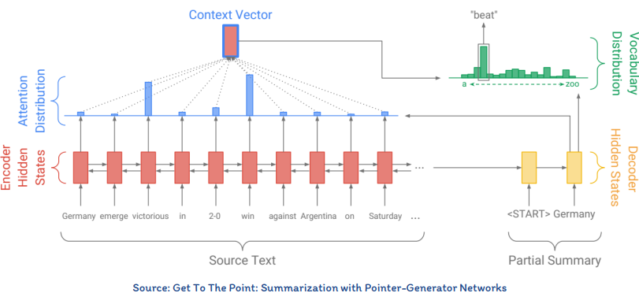

## خلاصه‌سازی متن

در این بخش به مبحث خلاصه‌سازی متن می‌پردازیم. هدف در خلاصه‌سازی این است که یک متن با طول کمتر از متن اصلی حاصل شود به طوری که حاوی اطلاعات مهم  در متن اصلی باشد یا مرتبط‌ترین اطلاعات را برای یک کاربر دربر داشته باشد.

کاربردهای خلاصه‌سازی متن عبارتند از:

1. ساخت یک متن خلاصه یا چکیده برای یک مقاله یا خبر
2. خلاصه کردن رشته‌ای از ایمیل‌ها
3. نمایش خلاصه‌ای از یک وبسایت توسط متورهای جستجو
4. ساده‌سازی یک متن جهت فهم بهتر

در خلاصه‌سازی ممکن است که نیاز باشد یک یا چند متن خلاصه شود. به همین سبب خلاصه‌سازی را می‌توان از این جهت به دو دسته زیر تقسیم کرد.

1. خلاصه‌سازی تک سندی: خلاصه‌سازی یک سند
2. خلاصه‌سازی چند-سندی: خلاصه‌سازی چند سند به صورت همزمان

### روش‌های خلاصه‌سازی متن

به صورت کلی دو روش برای خلاصه‌سازی یک متن وجود دارد:

1. خلاصه‌سازی استخراجی (Extractive summarization)
2. خلاصه‌سازی چکیده‌ای (Abstractive summariz)

در خلاصه‌سازی استخراجی متن جدیدی تولید نمی‌شود. بلکه مهمترین جملات از متن اصلی برداشته می‌شود و در متن خلاصه شده کپی می‌شود. در این روش نیاز است تا جملات یک متن رتبه‌بندی شوند و سپس براساس این رتبه‌بندی، مهمترین موارد انتخاب شوند. این روش بسیار ساده است و در کارهای گذشته بیشتر از این روش استفاده می‌شده است. نمونه‌ای از این روش را در موتورهای جستجو مشاهده می‌کنید.

اما در خلاصه‌سازی چکیده‌ای یک متن جدید تولید می‌شود و هیچ یک از جملات موجود در متن اصلی مستقیما وارد خلاصه نمی‌شوند. این روش سخت‌تر از روش قبلی است اما بسیار به روشی که انسان برای خلاصه‌سازی استفاده می‌کند شبیه است.

در این جا ما قصد داریم تا به مدل‌هایی بپردازیم که از روش چکیده‌ای تبعیت می‌کنند. معمولا برای این مسئله از مدل‌های کدگذار-کدگشا استفاده می‌کنند که هم ورودی کدگذار دنباله است و هم ورودی کدگشا . لذا به این مدل‌ها دنباله به دنباله یا Seq2seq می‌گویند. یکی از این مدل‌ها را در شکل زیر مشاهده می‌کنید.

> تمرین1: ابتدا مجموعه داده CNN/Daily Mail را از [این لینک](https://github.com/abisee/cnn-dailymail) دانلود کنید. سپس با استفاده شبکه‌های عصبی ترنسفورمر مدلی طراحی کنید که اخبار را از شما بگیرد و یک متن خلاصه برای هر خبر تولید کند.