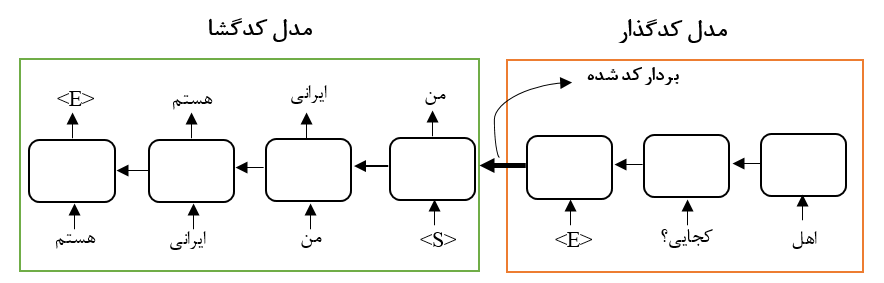
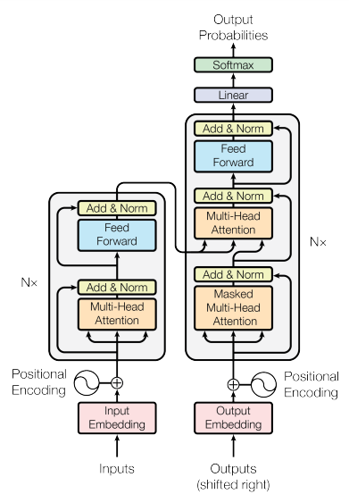

# شبکه‌های عصبی کدگذار کدگذار-کدگشا

شبکه‌های عصبی کدگذار- کدگشا (Encoder-Decoder) نوعی شبکه عصبی هستند که ورودی و خروجی آن‌ها یا از ابعاد متفاوت هستند و یا از نوع و جنس متفاوت. 

به عنوان نمونه برای مسائلی که ورودی آن‌ها از جنس تصویر و خروجی آن‌ها از جنس متن است می‌توان از شبکه‌های عصبی کدگذار-کدگشا استفاده نمود. از جمله این مسائل می‌توان به Image Captioning  اشاره کرد.

همچنین زمانی که ورودی و خروجی از یک جنس هستند اما ابعاد ورودی و خروجی متفاوت است نیز می‌توان از شبکه‌های عصبی کدگذار-کدگشا استفاده کرد. به عنوان نمونه، مسئله ترجمه ماشین عصبی (Neural Machine Translation) نیز از همین دسته است. دلیل آن نیز این است که متن جمله مبدا معمولا دارای طول متفاوتی از متن جمله مقصد است. برای طراحی یک سیستم گفتگو نیز می‌توان از همین شبکه‌ها استفاده نمود. یک نمونه از این شبکه را می‌توانید در شکل زیر مشاهده کنید:

# شبکه‌های عصبی ترنسفومر

شبکه‌های عصبی ترنسفورمری نوعی شبکه‌ی عصبی کدگذار-کدگشا هستند. مقاله مرتبط به این شبکه را می‌توانید در [این‌جا](https://arxiv.org/pdf/1706.03762.pdf) مشاهده کنید. بخش اصلی تشکیل‌دهنده این شبکه‌های عصبی مکانیزم خود-توجه (self-attention) است. این مکانیزم هم در بخش کدگذار این شبکه‌ها و هم در بخش کدگشا آن‌ها مورد استفاده قرار گرفته است. 

ستون فقرات این شبکه‌ها را مکانیزم خود-توجه می‌سازد. این مکانیزم به ما این امکان را می‌دهد تا بتوانیم با دیدن کلیه‌ی توکن‌های دنباله ورودی، به صورت یکجا کل دنباله را به دنباله دیگری با همان طول نگاشت کنیم. اکنون فرض کنید $X \in \mathbb{R}^{n \times d}$ دنباله ورودی ما باشد. حال سه ماتریس زیر را می‌سازیم:

$$Q = W^{(Q)}X \  \  s.t. \ \ W^{(Q)} \in \mathbb{R}^{d \times d_){k}}$$

$$K = W^{(K)}X \  \  s.t. \ \ W^{(K)} \in \mathbb{R}^{d \times d_{k}}$$

$$V = W^{(V)}X \  \  s.t. \ \ W^{(V)} \in \mathbb{R}^{d \times d_{v}}$$

اکنون با داشتن این سه ماتریس مکانیزم خود-توجه به صورت زیر ساخت می‌شود:

$$X^{'} = softmax(\frac{QK^{T}}{\sqrt{d_k}})V$$

> تمرین1: با مطالعه کامل مقاله اصلی ترنسفورمرها، [این کد](https://colab.research.google.com/github/dlmacedo/starter-academic/blob/master/content/courses/deeplearning/notebooks/tensorflow/transformer.ipynb) را، که در واقع یک مترجم زبان پرتغالی به انگلیسی می‌سازد، را اجرا کنید و جزئیات آن را گزارش کنید.

